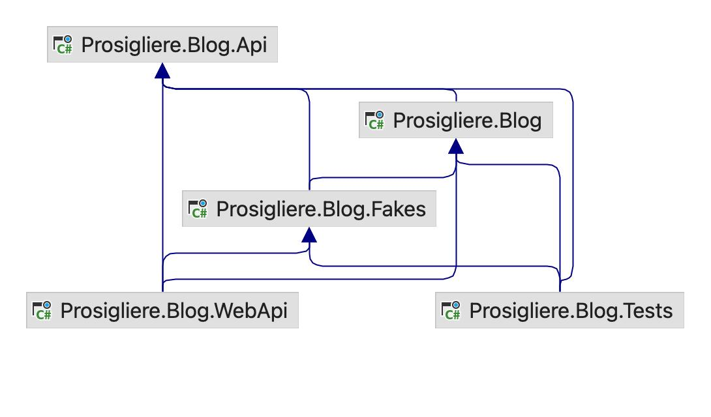

# Prosigliere.Blog
## Installation
Install [.net 7](https://dotnet.microsoft.com/en-us/download/dotnet/7.0) and [PostgreSQL](https://www.postgresql.org/download/).

Install [Entity Framework Core tools](https://learn.microsoft.com/en-us/ef/core/cli/dotnet)
```bash
dotnet tool install --global dotnet-ef
```
## Build
```bash
dotnet build
```
## Run Tests
```bash
dotnet test
```
## Run Postman Collection
There is a [Postman Collection](Prosigliere.Blog.postman_collection.json) file.
You can import it in Postman with `File > Import`.
Right click the collection and select `Run Collection`.

## Run Migrations
```bash
cd Prosigliere.Blog.WebApi
dotnet ef database update
```
## Run WebApi
```bash
cd Prosigliere.Blog.WebApi
dotnet run
```
## Run WebApi with Fake Storage
If you want to run the application with a Fake storage. 
Modify [appsettings.Development.json](Prosigliere.Blog.WebApi/appsettings.Development.json). 
Keep in mind that the database will start from scratch each run.
If you use this feature, it is not necessary to install Postgres.
```json
{
  "Storage": "Fake"
}
```
## Explore WebApi with Swagger/Swagger UI
* Swagger UI: [http://localhost:5041/swagger/index.html](http://localhost:5041).
* Swagger Endpoint: [http://localhost:5041/swagger/v1/swagger.json](http://localhost:5041/swagger/v1/swagger.json). 
## Architecture
The solution contains a collection of projects each one defining an architectural layer.
### Blog.Api
Class Library. A collection of interfaces defining all possible operations in the application and all the data structures used as inputs and outputs for these operations ([DTOs](https://martinfowler.com/eaaCatalog/dataTransferObject.html)).
* **Service Interfaces**: Set of interfaces defining all possible operations. Arguments are `RequestObject` and the return type is `Result<ResponseObject>`.
* **Request Objects**: Input DTOs. Defined as C# records.
* **Response Objects**: Output DTOs. Defined as C# records.
* **Result Object**: Indicates that an operation could return multiple types depending on the situation.
Used for error handling without exceptions.
### Blog
Class Library. The application layer. Contains the business logic of the application.
Implements abstractions in `Blog.Api`. 
Interfaces with storage using [Repository](https://martinfowler.com/eaaCatalog/repository.html) interfaces.
Easy to unit test in isolation from infrastructure, allowing a fast running unit tests suite.
* **Service Objects**: Implements Service Interfaces. Define business rules interacting in an abstract way with infrastructure.
* **Repository Interfaces**: Define data access operations in abstract.
* **Entities**: Persistant data types. Used as arguments and return types for Repository implementations.
Used by EntityFramework (The Blog class library **does not** depend on EntityFramework).
* **Validators**: Define rules for Request Objects validation using [FluentValidation](https://docs.fluentvalidation.net/en/latest/).
### Blog.WebApi
WebApi Project. Contains all http, ASP MVC specific logic and EntityFramework implementations of Repositoes.
* **Controllers**: Define endpoint routes.
Proxies to Service objects.
Translate Result Objects to ASPT MVC `IActionResult`.
Define Swagger documentation using Annotations.
* **Storage**:
Data access logic specific to EntityFramework.
* **Migrations**:
EntityFramework migrations.
* **Config**:
Connection string and other configurations in [appsetting.json](Prosigliere.Blog.WebApi/appsettings.json)
and [appsettings.Development.json](Prosigliere.Blog.WebApi/appsettings.Development.json).
### Blog.Tests
Class Library.
Contains all the tests for the application logic/business rules.
Fast unit tests.
It runs isolated from the database.
It does not test controllers.
* **Tests**: xUnit light way, behavioral style unit tests, isolated from database. 
They don't test implementation details. Services are tested as black boxes.
* **Samples**: Sample objects for testing purposes. 
Provide data necessary for tests to pass but not relevant for understanding the tests.
### Blog.Fakes
Class Library. 
Contains fake implementations of Repository objects for fast testing purposes.
It is also possible to run the WebApi with Fakes.
### Dependencies Between Projects
The following diagram show the dependencies between projects.


## Pending
* Authentication with JWT Token.
* Authorization.
* Validations to avoid users access data that belongs to another user.
* Update and Delete posts.
* Update and Delete comments.
* Tag Posts.